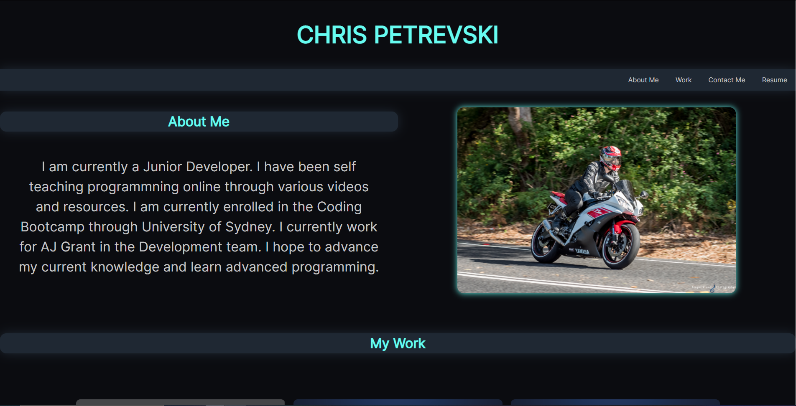

# 02-hw-portfolio #
CSS Portfolio for second homework task

Create a Webiste for my own portfolio from scratch.

## Acceptance Criteria ##

Acceptance criteria is as states.

GIVEN I need to sample a potential employee's previous work
WHEN I load their portfolio
THEN I am presented with the developer's name, a recent photo or avatar, and links to sections about them, their work, and how to contact them
WHEN I click one of the links in the navigation
THEN the UI scrolls to the corresponding section
WHEN I click on the link to the section about their work
THEN the UI scrolls to a section with titled images of the developer's applications
WHEN I am presented with the developer's first application
THEN that application's image should be larger in size than the others
WHEN I click on the images of the applications
THEN I am taken to that deployed application
WHEN I resize the page or view the site on various screens and devices
THEN I am presented with a responsive layout that adapts to my viewport

## Work Carried Out ##

Created basic structure website.

Created a heading and nav bar underneath with the links nested to the side.

Created an about section with a picture and small about me section.

Created a work section displaing apps I have created. Was instructed to have the first one bigger but I wish to choose the even tile layout for my page.

Created a contact me section with text box's. Currently under development for actually sending an email to my address.

Created a footer for copyright logo and also a small link to my github.

Created a reset.css stylesheet.

Created a CSS stylesheet.

Added a new webfont i liked.

Added styles to different sections.

Added FLEXBOX for a responsive layout.

Small style changes to layout.

Added links to git hub and resume.

Added links to sections of the page from the navbar.

## Links ##

# GitHub #

https://github.com/CPetrevski

# Web Page #

https://cpetrevski.github.io/02-hw-portfolio/

